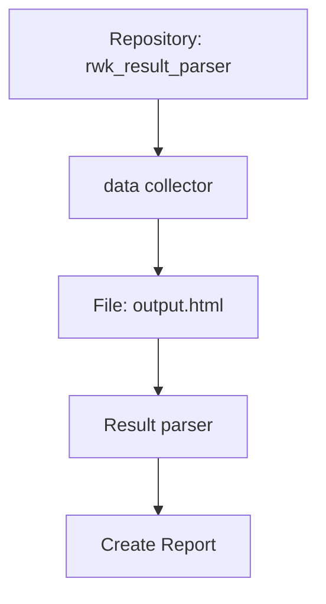

# RWK Result Parser

This Repository stands for parsing and analyzing RWK results from Gau ANB's website [RWK shooting](https://www.rwk-shooting.de/drucken/index.php).  
The results are visible [here](https://github.com/dischii/rwk_result_parser/deployments/github-pages).

## Overview



## Getting Started

To install the required dependencies, create virtual environment: 
```bash
python -m venv .venv
```

Activate the virtual environment  
```powershell
[LINUX]
source .venv/bin/activate

[WINDOWS]
.\.venv\Scripts\activate
```

Install the required dependencies:
```bash
pip install -r requirements.txt
```

Run the script:
```bash
python main.py
```

Find artifacts in `svw-results/docs` and `temp/`.
